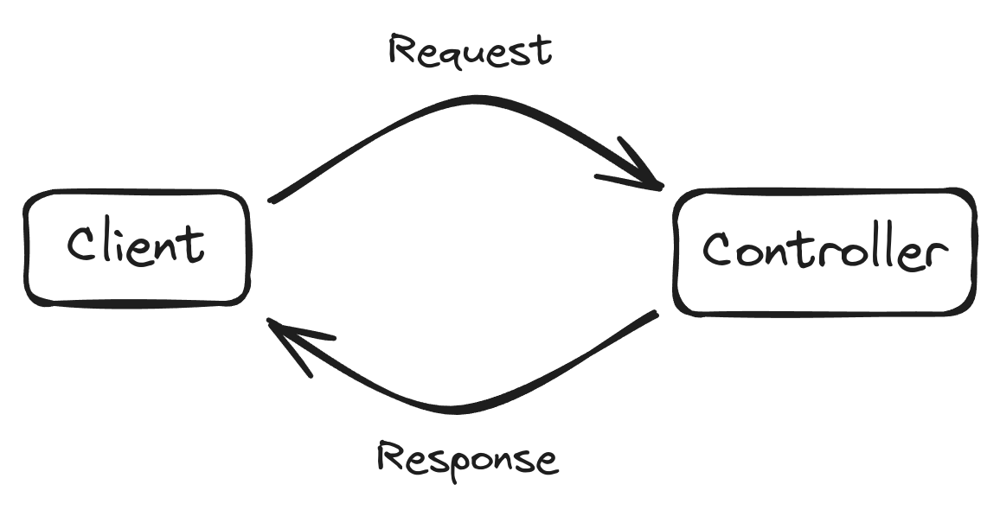
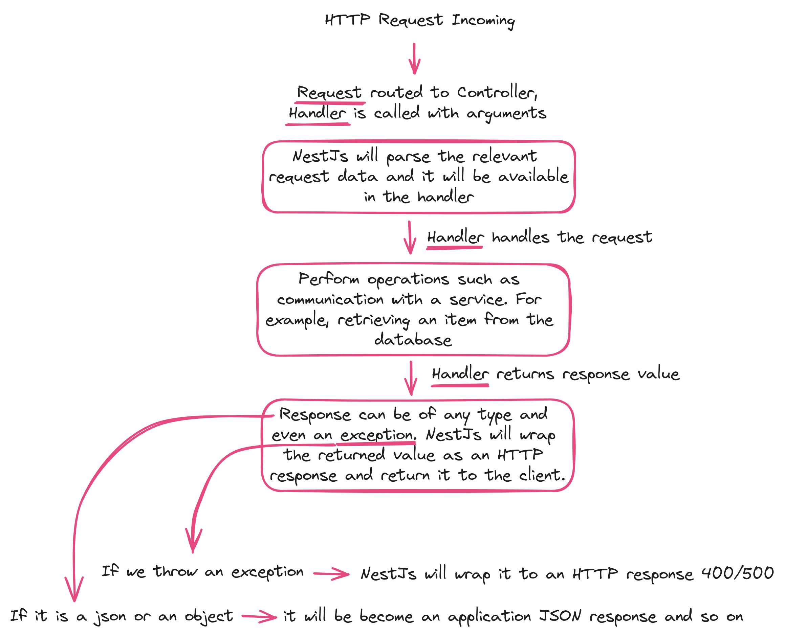

# NestJS Controller

- Responsible for handling incoming requests and returning responses to the client



- The controller will then be the entry point, communicate with the service and return the result.
- Bound to specific path (for example, `/tasks` for the task resource)
- Contains <u>handlers</u>, which <u>endpoints</u> and <u>request methods</u> (GET, POST, DELETE, etc.)
- Can take advantage of <u>dependency injection</u> to consume providers within the same module

## Defining a Controller

```ts
@Controller("/tasks")
export class TaskController {
  // ...
}
```

## Defining a Handler

```ts
@Get()
getAllTasks() {
  // ...
}

@Post()
createTask() {
  // ...
}
```


