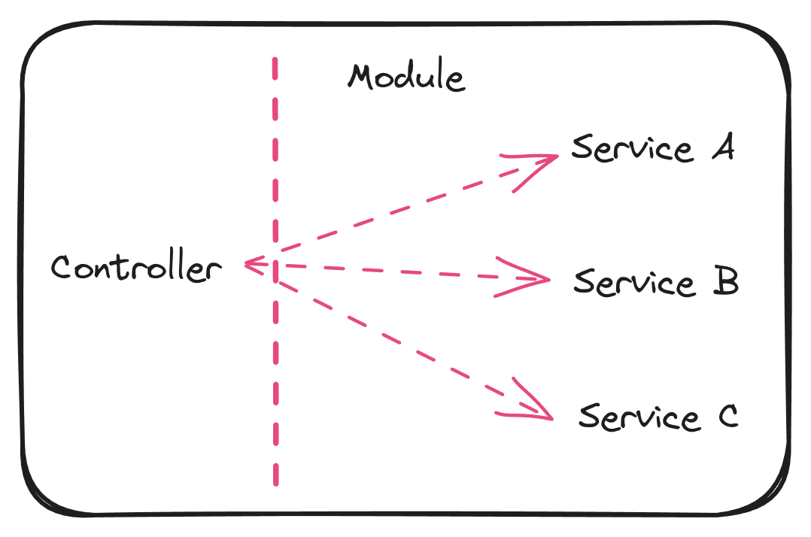

# NestJS Providers

- Can be injected into constructors if decorated as an `@Injectable`, via <u>dependency injection</u>
- Can be a **plain value**, a **class**, **sync/async factory**, etc.
- Providers must be <u>provided to a module</u> for them to be usable or <u>injectable</u>
- Can be exported from a module and then be available to other modules that import it.

## What is a service?

- Services are implemented using providers.

> [!IMPORTANT]
> Not all providers are services!

- Services can be implemented as singletons (That means, the same instance will be shared across the application - acting as a single source of truth). When wrapped with the `@Injectable` decorator and then provided to a module.
- Contains the main source of business logic

For example, a service will be called from Controller to validate data, create an item in the database and return a response that is complicated and needs to be calculated or mapped and so on.

