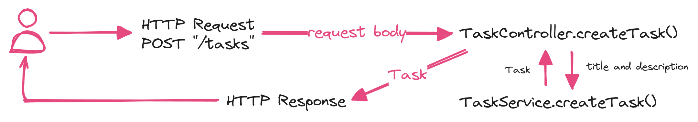
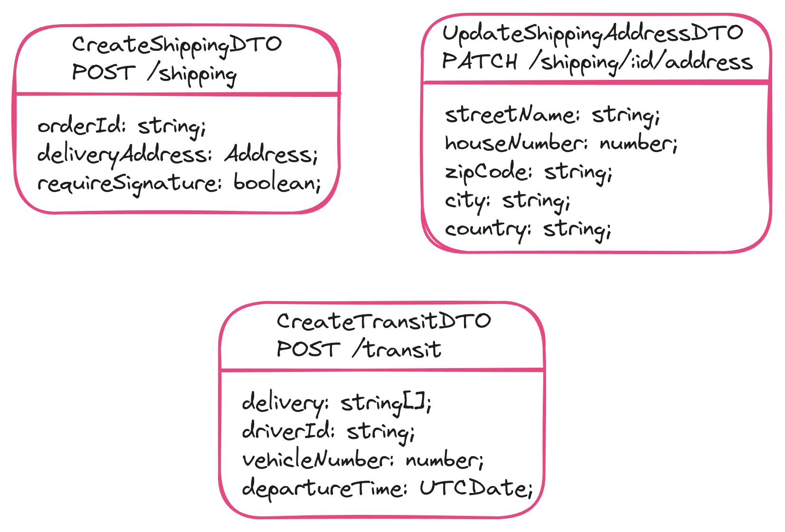

# Data Transfer Object (DTO)

Notice how many times we refer to the properties of a task within our code. Both in the controller and the service, just to retrieve the <ins>title and description</ins>.

So, software changes all the time. Imagine a situation where we need to make changes to the shape of data. Maybe at some point, we need to change the types of these parameters. Maybe as requirements change, we need to add additional information to tasks. To apply such changes, we will have to <ins>change the implementation</ins> in multiple places. This adds complexity to our application and makes it more difficult to scale it.

So, to put everything I just said in one sentence, we do not have a single source of truth, a main place where we manage the shape of data as it flows through the different components of our application.

## Definitions:

  - <ins>[Wikipedia](https://en.wikipedia.org/wiki/Data_transfer_object)</ins>: "A DTO is an object that carries data between processes."
  - <ins>[Stack overflow](https://stackoverflow.com/a/1058186/12151113)</ins>: "A DTO is an object that is used to encapsulate data and send it from one subsystem of an application to another."
  - <ins>NestJs Docs</ins>: "A DTO is an object that defines how the data will be sent over the network"
---

- Do not leak any behavior except for **storage**, **retrieval**, **serialization**, and **deserialization** of its own data
- Result in increased performance (although negligible in small applications)
- Can be useful for **data validation**
- It is **NOT** a model definition. It defines the **shape of data** for a **specific case** (or **specific operation** as it flows through the system), for example, transferring a task
- It does **NOT** define an entity
- Can be defined using an interface or a **class** (The recommended approach by NestJs docs. The reason is that the interface are a part of Typescript and therefore they are NOT preserved post compilation or at runtime)
- This class or interface is used by services and controllers, NOT intended as a definition of a domain model
- Data can be used across layers and implementations can be changed without affecting the definition of a domain model
- Classes allow us to do more, and since they are a part of Javascript, they will persist post-compilation.
- NestJS cannot refer to interfaces in run-time, but can refer to classes.

## Example

Imagine you're developing a system for a delivery company and you need to develop a CRUD application to handle and manage deliveries.

These details can be used across many parts of the application, such as controller, pipe, service and repository. And these will also become very useful when we need validate data.

> [!IMPORTANT]
> - DTOs are not mandatory
> - The value they add makes it worth while to use them when applicable
> - Applying the DTO pattern as soon as possible will make it for to maintain and refactor your code
