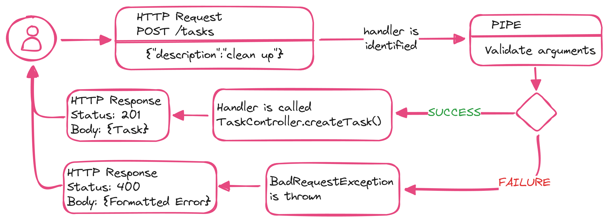

# NestJS Pipes

- Pipes operate on the arguments to be processed by the route handler, just before the handler is called
- Pipes can perform <ins>data transformation</ins> or <ins>data validation</ins>
- Pipes can return data - either original or modified - which will be passed on to the route handler
- Pipes cn throw exceptions. Exceptions thrown will be handled by NestJS and parsed into an error response
- Pipes can be asynchronous

## Custom pipe implementation

- Pipes are classes annotated with the `@Injectable` decorator
- Pipes must implement the <ins>PipeTransform</ins> generic interface. Therefore, every pipe must have a <ins>transform</ins> method. This method will be called by NestJs to process the arguments.
- The `transform()` method accepts two parameters:
  - `value`: the value of the processed argument
  - `metadata` (Optional): an object containing metadata about the argument
- Whatever is returned from the `transform()` method will be passed on to the route handler. Exceptions will be sent back to the client

### Handler-level pipes

<ins>Handler-level pipes</ins> are defined at the handler level, via the `@UsePipes()` decorator. Such pipes will process all parameters for the incoming requests.

```ts
@Post()
@UsePipes(SomePipe)
createTask(@Body('description') description) {/* ... */}
```

### Parameter-level pipes

<ins>Parameter-level pipes</ins> are defined at the parameter level. Only the specific parameter for which the pipe has been specified will be processed.

```ts
@Post()
createTask(@Body('description', SomePipe) description) {/* ... */}
```

### Global pipes

<ins>Global pipes</ins> are defined at the application level and will be applied to any incoming request.

```ts
app.useGlobalPipes(SomePipe);
```

### Parameter-level vs Handler-level pipes

It depends

<ins>Parameter-level pipes</ins> tend to be slimmer and cleaner. However, they often result in extra code added to handlers - this can get messy and hard to maintain.

<ins>Handler-level pipes</ins> require some more code, but provide some great benefits.

- Such pipes do not require extra code at the parameter level
- Easier to maintain and expand. If the shape of the data changes, it is easy to make the necessary changes within the pipe only.
- Responsibility of identifying the arguments to process is shifted to one central file - the pipe file
- Promote usage of DTOs which is a very good practice

